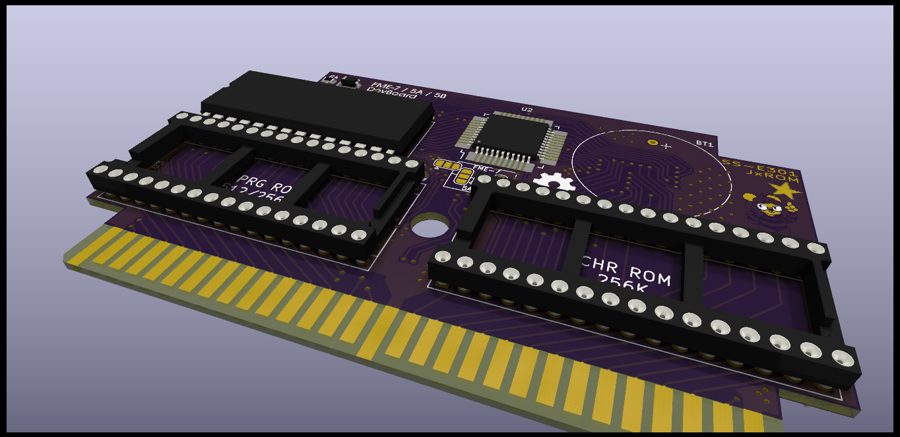

# FME7/S5A/S5B Development/Reproduction Cartridge Board

An Open-Source HardWare (OSHW) development/reproduction cartridge PCB designed for INES mapper 69.

## License

The PCB and schematics are licensed under the TAPR Open Hardware License ([www.tapr.org/OHL](http://www.tapr.org/OHL)). © Persune 2021

## Credits

- Lockster - Help and assistance with schematics
- lidnariq - Clarification on FME7 connections
- Special thanks to the NESDEV community, this project wouldn't have been possible without their extensive help and wiki.

## Support

Support me on [Ko-Fi](https://ko-fi.com/persune) to help me afford hardware development equipment and further improve this project!
